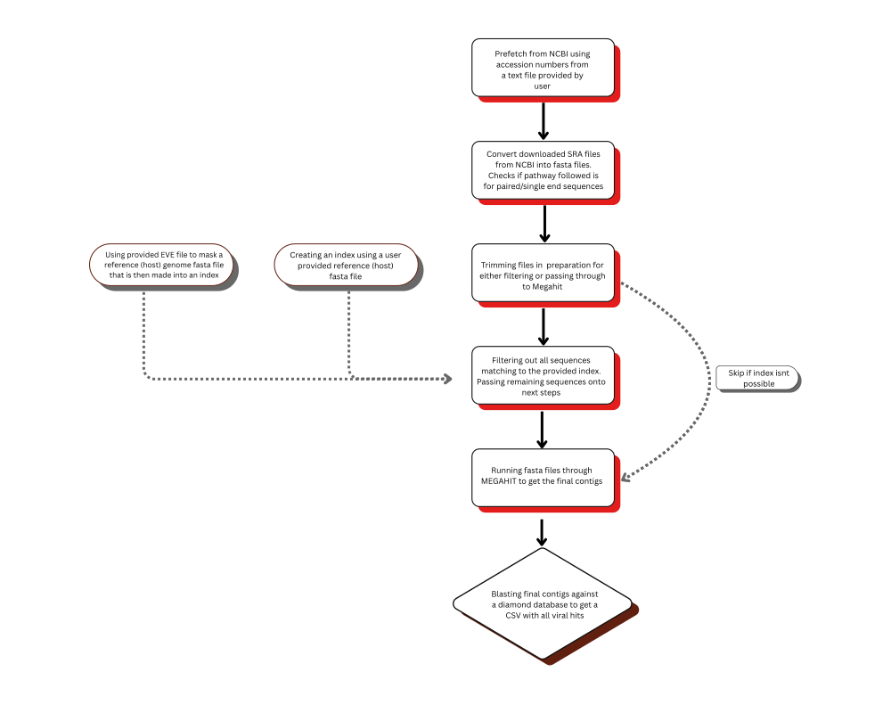

<p align="left">
  
</p>

# **detectADAM**

**detectADAM** (Accession Driven Analysis and Mining) is a Snakemake-based pipeline for the detection and analysis of viral sequences in publicly available sequencing datasets.

---

# **Workflow**

<p align="center">
  
</p>

Recommended input for the EVE file for masking is the `.fna` output of the pipeline [detectEVE](https://github.com/thackl/detectEVE).

---

# **Quickstart Guide**

```bash
# Download workflow
git clone https://github.com/CelineBos/detectADAM
cd detectADAM

# Install dependencies via mamba or conda (https://github.com/conda-forge/miniforge)
mamba create -n detectADAM
mamba activate detectADAM
mamba env update --file envs/envs.yml

# Update config file (if required)
nano config.yaml
##config file is in the below format, please enter necessary paths
accession_file: /pathway/to/accession/txt/file ##REQUIRED
diamond_db: /pathway/to/diamond/database ##REQUIRED
eves: "/pathway/to/eve/file" # file of all EVEs that should be masked from references
reference: "pathway/to/reference/file(s)" # if you have multiple reference, concatenate them into one file

# Run Snakemake
snakemake -c <# of cores>  # e.g. 1 / 8 / all

```

# **Output** 

The pipeline produces following outputs:

In the diamond result folder:
`<accession>.tsv` - diamond blast results from the final contigs generated by the pipeline. Note that the diamond blast is running on the assumption the database used also has taxonomic information

If index is created, it retains in the bowtie2_index folder the index files denoted by their `.bt2`

It also retains the megahit final contigs.


# **About**

detectADAM was developed as a masters project by C. Bos under the guidance of T. Hackl, S. Lequime & S. van der Meij, at the Rijksuniversiteit Groningen 2025. 

