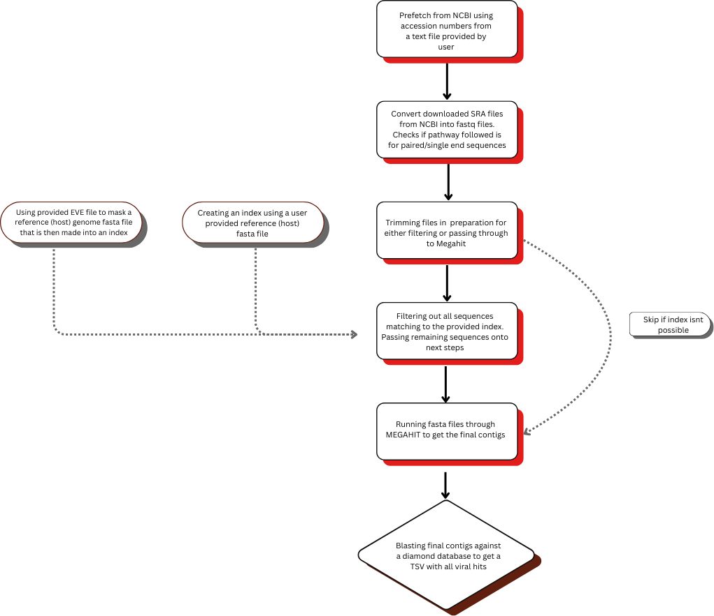

<p align="left">
  
</p>

# **detectADAM**

**detectADAM** (Accession Driven Analysis and Mining) is a Snakemake-based pipeline for the detection and analysis of viral sequences in publicly available sequencing datasets.

---

# **Workflow**

<p align="center">
  
</p>

Recommended input for the EVE file for masking is the `.fna` output of the pipeline [detectEVE](https://github.com/thackl/detectEVE).

---

# **Quickstart Guide**

```bash
# Download workflow
git clone https://github.com/CelineBos/detectADAM
cd detectADAM

# Install dependencies via mamba or conda (https://github.com/conda-forge/miniforge)
mamba create -n detectADAM
mamba activate detectADAM
mamba env update --file envs/envs.yml

# Update config file (if required)

# Run Snakemake
snakemake -c <# of cores>  # e.g. 1 / 8 / all

```

# **Output** 

The pipeline produces following output


# **About**

detectADAM was developed as a masters project by C. Bos under the guidance of T. Hackl, S. Lequime & S. van der Meij, at the Rijksuniversiteit of Groningen 2025. 

